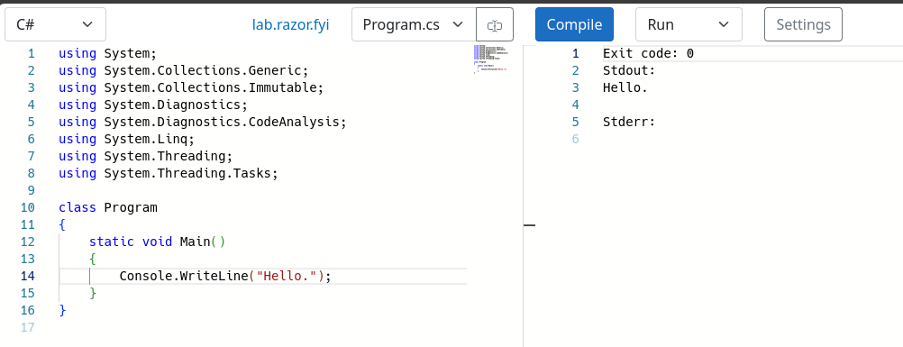

# DotNetInternals

C# and Razor compiler playground in the browser via Blazor WebAssembly.

| [C#](https://lab.razor.fyi/#fY87CgJBEETBsENPMBhpMhfYSFZQYQVBwbidbdbG2W6cHgURD-YNPJb4CWRBK6tXLym49wCWSZuErQ_Wv_WOxtK41dkytQV8N19qjBQyq5ifklDi8MeYt-0x4zZSx5kwNqKWOdjvxZda01gwno27WsVy6KD1LhHWLM0v7tdoeysAQkQz93kMF3DOOcuYObiTcu0WyDIcvfB7fKZUMY3kN4kzVSw0HMwoRvWDUfGSrnCFBw) | [Razor](https://lab.razor.fyi/) |
|:-:|:-:|
|  |  |

## Features

- Razor/CSHTML to generated C# code / IR / Syntax Tree / Errors.
- C# to IL / Syntax / decompiled-C# / Errors / Execution console output.
- Any Roslyn/Razor compiler version (NuGet official builds or CI builds given PR number / branch / build number).
- Offline support (PWA).
- VSCode Monaco Editor.
- Multiple input sources (especially useful for interlinked Razor components).
- C# Language Services (completions, live diagnostics) - experimental.
- Configuring any C# parse options (e.g., LangVersion, Features).

## Development

The recommended startup app for development is `src/Server`.

To hit breakpoints, it is recommended to turn off the worker (in app settings).

- `src/App`: the WebAssembly app.
  - `cd src/App; dotnet watch` - `src/Server` is better for development though.
- `src/Compiler`: self-contained project referencing Roslyn/Razor.
  It's reloaded at runtime with a user-chosen version of Roslyn/Razor.
  It should be small (for best reloading perf). It can reference shared code
  which does not depend on Roslyn/Razor from elsewhere (e.g., `Shared.csproj`).
- `src/RazorAccess`: `internal` access to Razor DLLs (via fake assembly name).
- `src/RoslynAccess`: `internal` access to Roslyn DLLs (via fake assembly name).
- `src/Server`: a Blazor Server entrypoint for easier development of the App
  (it has better tooling support for hot reload and debugging).
  - `cd src/Server; dotnet watch`
- `src/Shared`: code used by `Compiler` that does not depend on Roslyn/Razor.
- `src/Worker`: an app loaded in a web worker (a separate process in the browser),
  so it does all the CPU-intensive work to avoid lagging the user interface.
- `test/UnitTests`
  - `dotnet test`

## Attribution

- Logo: [OpenMoji](https://openmoji.org/library/emoji-1FAD9-200D-1F7EA/)
- Style: [Fluent UI](https://www.fluentui-blazor.net/)
- Icons: [Fluent UI Icons](https://github.com/microsoft/fluentui-system-icons)

## Related work

Razor REPLs:
- https://blazorrepl.telerik.com/
- https://netcorerepl.telerik.com/
- https://try.mudblazor.com/snippet
- https://blazorfiddle.com/

C# REPLs:
- https://dotnetfiddle.net/
- https://onecompiler.com/csharp

C# compiler playgrounds:
- https://sharplab.io/
- https://godbolt.org/

XAML REPLs:
- https://playground.platform.uno/
